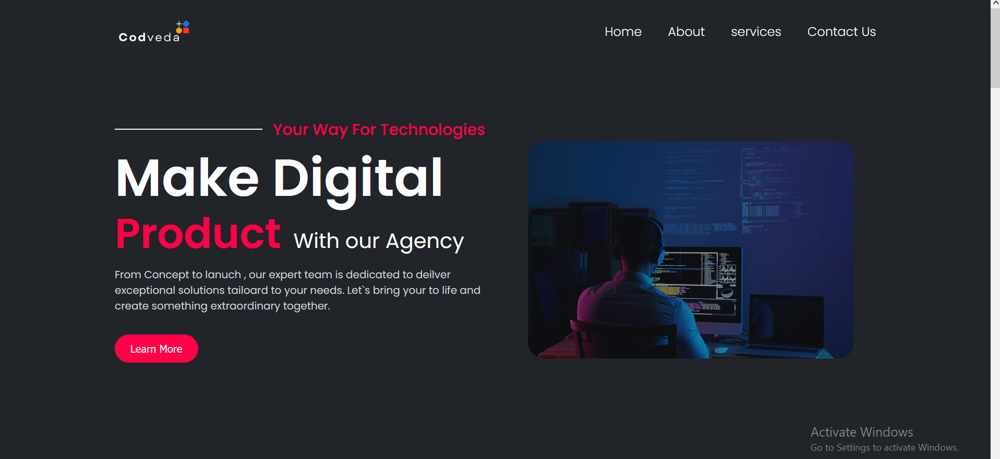

# 🌐 Landing Page – Codveda Internship Task

This is a simple and responsive **Landing Page** created as part of my **Front-End Development Internship at Codveda Technologies**.  
The project focuses on clean UI, responsive design, and optimized structure for better performance.

---

## 🚀 Features
- Responsive design (works on desktop, tablet, and mobile).
- Modern layout using **HTML, CSS, and JavaScript**.
- Organized **assets folder** for images and resources.
- Ready for future **Performance Optimization** improvements.

---

## 📸 Preview
  
---

## 🛠️ Technologies Used
- **HTML5**
- **CSS3 (Flexbox & Grid)**
- **JavaScript**
- **Git & GitHub** (for version control and hosting)

---

## 🎯 Internship Context
This project was developed as **Task 1** during my internship with **Codveda Technologies**.  
It showcases my ability to build a functional and responsive landing page from scratch.  

---

## 🌍 Live Demo
🔗 [View Project on GitHub Pages](https://hossam-hamad-web.github.io/Landing-Page/)  

---

## 📬 Contact
👤 **Hossam Hamad Abd-Elazem Abd-Elghani**  
💼 Front-End Developer Intern @ Codveda Technologies  
🔗 [LinkedIn Profile](https://www.linkedin.com/in/hossam-hamad/)  
